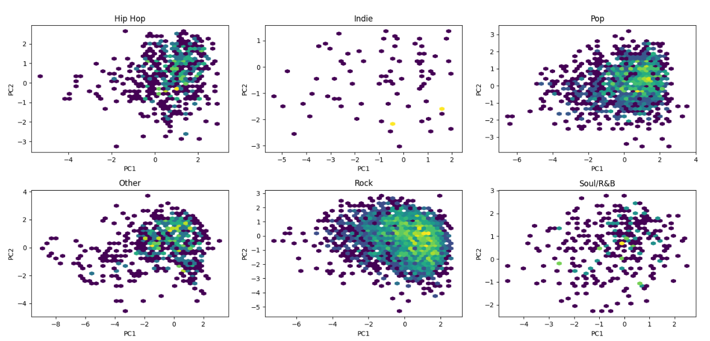

# Analysing Genre Preferences

## Abstract

This project analyzes music genre preferences and audio feature evolution from 1965 to 2023 using the Spotify Web API. The study examines how musical characteristics have transformed over nearly six decades, providing quantitative insights into genre popularity trends and the relationship between audio features and musical classification. It also examines the rise in music consumption driven by the convenient and affordable access offered by digital platforms such as Spotify, iTunes, and others.

## Introduction

Music preferences reflect cultural changes and technological advancements over time. This research leverages Spotify's comprehensive database to analyze genre evolution through quantitative audio features. By examining data spanning 58 years, the study identifies patterns in musical preferences and provides insights into both short-term trends and long-term shifts in the music industry.

## Methodology

The dataset was constructed through systematic data extraction using the Spotify Web API, focusing on popular songs from 1965 to 2023. Each track includes nine key audio features: acousticness, danceability, energy, instrumentalness, liveness, loudness, speechiness, tempo, and valence. The analysis combines descriptive statistics, temporal trend analysis, and correlation analysis to understand genre preferences and their evolution.

Audio features represent quantitative measures of various musical characteristics, enabling statistical analysis of genre preferences across different time periods. The analytical approach examines how different audio feature combinations correspond to various musical genres and how these relationships have changed over time.

## Key Visualizations
### Genre Distribution Analysis


The genre distribution charts illustrate how different musical genres have gained and lost popularity across various time periods. These visualizations highlight the cyclical nature of some genres and the emergence of new musical styles throughout the decades.


### Genre Clustering Analysis


The clustering visualization demonstrates how genres group together based on their audio characteristics, revealing similarities and differences between traditionally distinct musical categories. This analysis provides a data-driven perspective on genre boundaries and relationships.

### Trends in popularity of music


The plots indicate a rise in the number of listeners, attributed to the easy accessibility offered by digital music platforms. This trend is also reflected in the growing popularity of singer-songwriters.

### Top Artists over the years


### Music Evolution Over time


This visualization shows the evolution of key audio features across decades, revealing how characteristics like energy, danceability, and acousticness have changed from 1965 to 2023. The plot demonstrates clear trends in musical production styles and listener preferences over time.

### Temporal Trend Analysis


### Audio Feature Correlation Matrix


The correlation heatmap reveals relationships between different audio features, showing which characteristics tend to appear together in popular music. This analysis provides insights into the underlying structure of musical preferences and how different sonic elements interact.

### Genre popularity over time


### Principal Component Analysis per Genre


## Results and Discussion

The analysis reveals significant changes in audio characteristics over the study period, reflecting both technological advancements and cultural shifts. Certain audio features demonstrate cyclical patterns, while others show consistent directional changes indicating fundamental shifts in music production and consumption.

Genre boundaries appear fluid when examined through audio features, with significant overlap between traditionally distinct categories. Strong correlations exist between certain audio features, indicating that musical characteristics cluster in predictable ways and that each era has characteristic "sonic signatures."

## Technical Implementation

The project utilizes Python with pandas for data manipulation, numpy for numerical computations, and matplotlib/seaborn for visualization. The Spotify Web API serves as the primary data source, accessed through the spotipy library. Statistical analysis employs descriptive statistics, correlation analysis, and time series analysis to extract meaningful insights.

## Conclusions

This research demonstrates the value of quantitative analysis in understanding music preferences and genre evolution. The findings provide insights into how musical characteristics have changed over time and how these changes reflect broader cultural and technological trends. The methodology provides a framework for ongoing analysis of music trends and real-time monitoring of emerging musical preferences.

## Repository Structure

```
├── Data/                    # dataset
├── notebooks/              # Jupyter notebooks with analysis
├── Plots/                  # Generated visualizations
├── Code/                    # Source code and utilities
└── README.md              # Project documentation
```

## Getting Started

1. Clone the repository
2. Install required dependencies: `pip install spotipy pandas numpy matplotlib seaborn jupyter`
3. Configure Spotify API credentials
4. Run the analysis notebooks
5. Explore generated visualizations

## Author

**Srivarshitha**  
GitHub: [@16srivarshitha](https://github.com/16srivarshitha)

## Acknowledgments

This research was made possible through Spotify's Web API, which provides comprehensive audio feature analysis and metadata. The project contributes to understanding music as both an artistic and cultural phenomenon.
